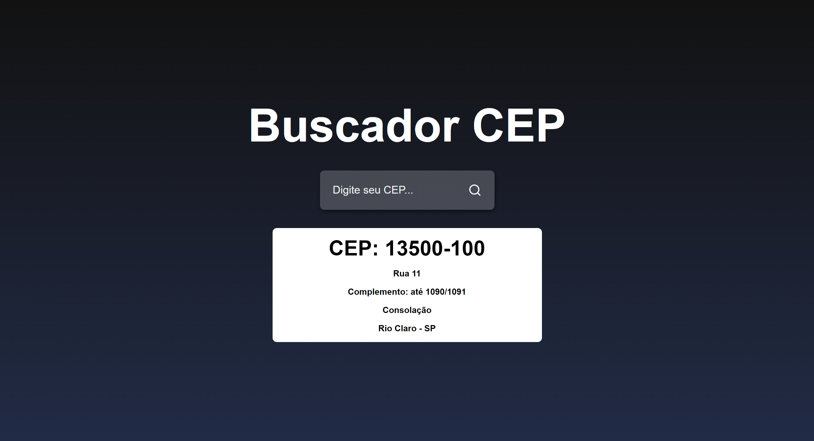
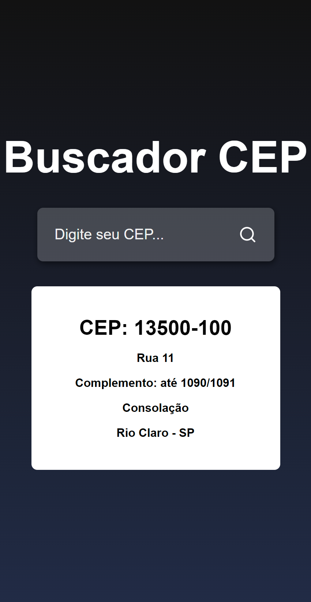

# Zip Code Finder

> This project was made to use api knowledge, in the following case we used an api to fetch zip code and we did it in react js

## Table of contents

- [Overview](#overview)
  - [The challenge](#the-challenge)
  - [Links](#links)
  - [Screenshot](#screenshot)
- [My process](#my-process)
  - [Built with](#built-with)

## Overview

### The challenge

Users should be able to:

- View the site in different formats
- Search for different zip codes
- View provided zip code information
- Search for other zip codes

### Links

- Live Site URL: https://zip-code-finder.netlify.app

### Screenshot

  - Desktop
  
    
    
  - Mobile
    
    

## My process

### Built with

- REACT JS
- HTML
- CSS
- JS

[⬆ Back to the top](#zip-code-finder) 
